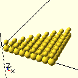

# PSML : Python Solid Modeling Library

version: 0.01 - 2020-02-22

This is a Python library (Python 3 required) for writing
3D models that can be rendered and processed by 
[OpenSCAD](https://www.openscad.org).

OpenSCAD is a great tool for rendering a 3D model and generating
an stl file from it for 3D printing.
The OpenSCAD built-in language is effective for simple projects
and I like its functional-programming feeling,
but working on more complex projects I missed the 
general-purpose features of a true programming language.
So why not use Python to create OpenSCAD files?
Apparently I was not the first with this idea, but I found the
existing libraries unsatisfactory, at least to me.
(That might say more about me than about those libraries.)
So as stubborn programmers do, I created yet another one.

~~~Python
from psml import *
( sphere( 15 ) + 
  shift( 0, 0, 18 ) ** (
      sphere( 10 ) +
      rotate( 90, 0, 0 ) ** cylinder( 2, 15 ))).write()
~~~

Sphere and cylinder are 3D solids. 
Shift is a 3D filter that shifts its subject in the specified
(z, y, z) direction. 
Rotate is a filter that rotates its subject by the specified angles 
(in degrees, around the x, y and z axes).
The \*\* (Python power operator) applies a filter 
like shift or rotate to a solid, yielding a modified solid.
The + operator combines solids.
Finally the write method writes the corresponding OpenSCAD code
to the output.scad file.
When this file is opened in OpenSCAD, it shows a simple snowman.

The power of a general purpose language, in this case Python's
list comprehension and reduce, can be used to create seemingly complex
models with just a few lines.
(A pity that full rendering of this model takes quite some time!)
 
~~~Python
from psml import *
from functools import reduce
model = reduce( 
   lambda a, b: a + b, (
      ( 25 * shift( x, y )) ** (
         sphere( 15 ) + 
         shift( 0, 0, 30 ) ** sphere( 10 ) + 
         cylinder( 3, 30 )
      ) for x in range( 1, 10 ) for y in range( 0, x )))
model.write( "output.scad" )
~~~

To use psml, arrange for the psml/psml.py file 
to be importable from your project. 
In the examples I add its directory to the search path.

~~~Python
import sys
sys.path.append( "../psml" )
~~~

Feature summary ([sphinx documentation](./html/index.html)):
   - basic solids: rectangle, box, circle, cylinder, sphere
   - export to OpenSCAD: write()
   - operators: + - *
   - basic filters: shift, rotate, mirror, extrude
   - shift arithmetic
   - more filters: repeat2, repeat4, repeat8
   - first-class voids: negative, positive

My workflow is
   - edit the Python sources
   - run it (I prefer the command line)
   - have OpenSCAD with the result file open, 
     enable Design => Automatic Reload and Preview.
   
This library is very much work-in-progress. 
Feedback is welcome,
constructive feedback even more.

Similar libraries:
   - [SolidPython](https://github.com/SolidCode/SolidPython)
   - [OpenPySCAD](https://pypi.org/project/OpenPySCAD)
   
-----------------------------------------------------------------------------   
   
ToDo list
- simplify and check the shift parameters
- mirror: check 0/1
- more examples
- more openscad primitives
- text, extend from dice example
- dice: handle rounding (shrink text), could be a library element
- tests for the error handling
- pip installer
- extract example text and put it in the readme.md
- None is acceptable 
- update examples check file times??
- longer parameter names
- virtual box that can be asked? with wall-thickness?
- split should be an operator
- better name for operator / filter -> manipulator
- move project box to work
- text parameters
- https://medium.com/@richdayandnight/a-simple-tutorial-on-how-to-document-your-python-project-using-sphinx-and-rinohtype-177c22a15b5b
- scale
- resize
- other extrudes
- color?
- multimatrix?
- minkowski?
- hull?
- rotate_extrude?
- polyhedron?
- allow negative extrusion?

- vector init, operators
- make rotate etc. functions, supply a lambda
- make rectangle etc. show derived from -> shape (or function!)

-----------------------------------------------------------------------------      
      
(c) Wouter van Ooijen (wouter.vanooijen@hu.nl) 2020

Distributed under the Boost Software License, Version 1.0.
(See accompanying file license_1_0.txt or copy at 
http://www.boost.org/LICENSE_1_0.txt) 